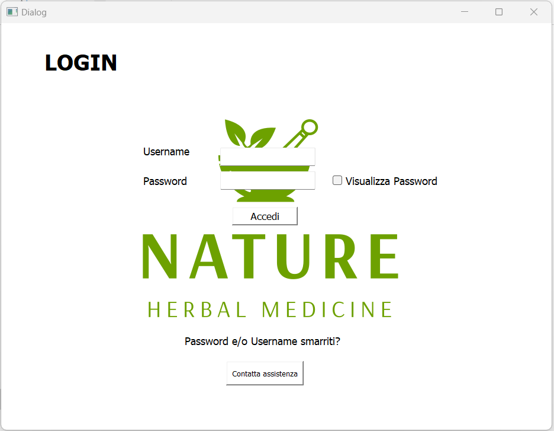
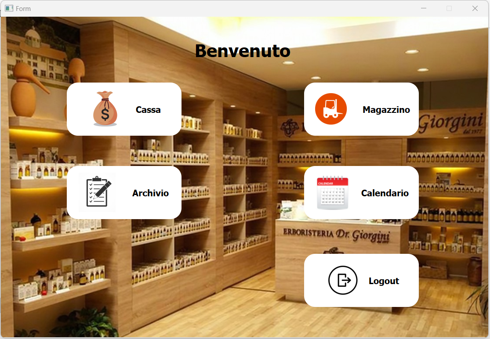
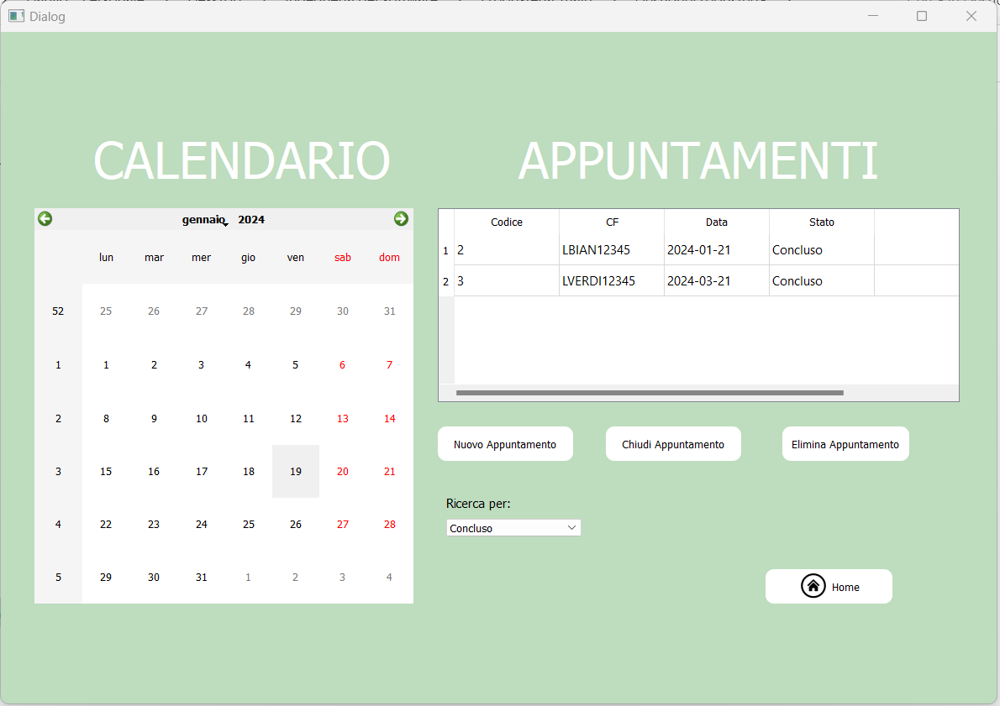
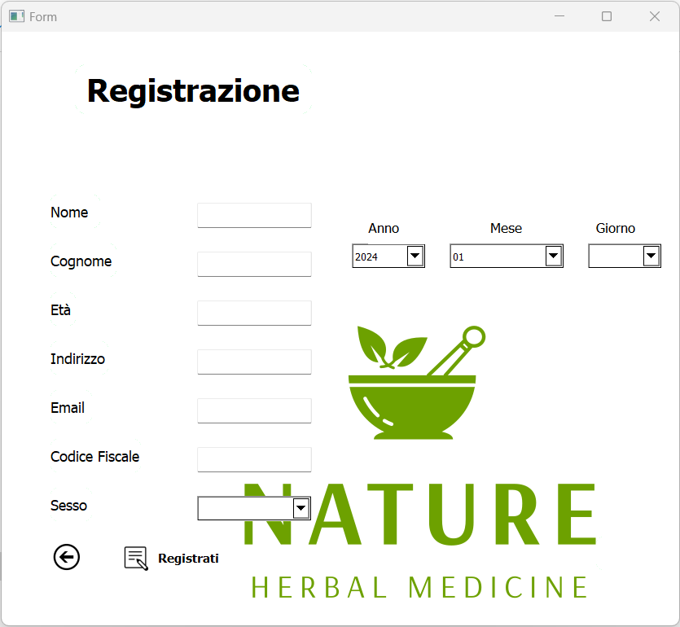
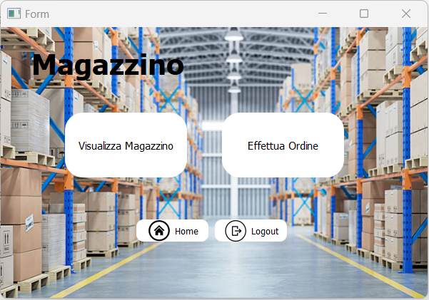
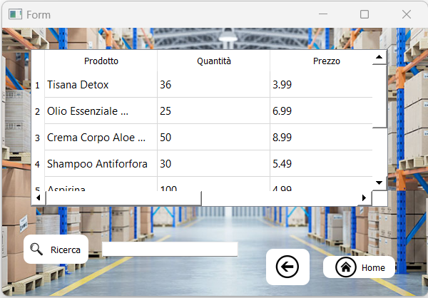

# *GESTIONE ERBORISTERIA*

Il progetto si propone di modellare un sistema informatico per la gestione di una farmacia.
L’ipotesi di modellazione alla quale il progetto aderirà sarà quella di una farmacia rurale, il cui personale è composto unicamente dal Direttore Responsabile, addetto alla vendita di farmaci e all’esecuzione di tamponi. 

Il sistema garantirà all’Amministratore l’accesso a funzionalità che consentono la gestione di una serie di operazioni quali:
- Gestione cassa
- Gestione magazzino
- Gestione ordini
- Gestione degli archivi
- Gestione degli appuntamenti

# Installation

Il software è stato sviluppato in Python con l'ausilio di PyCharm. 

Per installare installare il progetto su PyCharm:
- Dal menu principale, scegli Git | Clone. Se il menu Git non è disponibile, scegli VCS | Ottieni da Controllo versione.
- Nella finestra di dialogo Ottieni da controllo versione, scegli GitHub a sinistra.
- Accedi a GitHub effettuando una delle seguenti operazioni:
- Se disponi di un token, fai clic su Usa token, quindi incolla il token nel campo Token e fai clic su Accedi.
- Altrimenti, fai clic su Accedi tramite GitHub.
- Inserisci le tue credenziali GitHub nella finestra del browser che si apre. Se hai abilitato l'autenticazione a due fattori, ti verrà chiesto di inserire un codice che ti verrà inviato tramite SMS o tramite l'applicazione mobile.
- Seleziona la repository da GitHub associati 
- Nel campo Directory, inserisci il percorso della cartella in cui verrà creato il tuo repository Git locale.
- Fare clic su Clona.

# Caratteristiche
## Gestione Erboristeria -  LOGIN

  

**CREDENZIALI:**  
*nome utente:* username  
*password:* password

La schermata di `Login` consente all'Amministratore di accedere al menù ed in caso di problematiche è garantita la possibilità di contattare l'assistenza.
## Gestione Erboristeria - MENU'

  

In seguito al login si accede al `menu delle funzionalità` attraverso il quale è possibile selezionare a quale schermata accedere e quali operazioni effettuare. 
## Gestione Farmacia - APPUNTAMENTI

  
  

La `Gestione Appuntamenti` consente di:
- **Visualizzare gli appuntamenti:** cliccando sulla data dell'appuntamento sul calendario nella tabella compariranno le relative informazioni. In alternativa è possibile filtrare tramite *Ricerca per* ottenendo gli appuntamenti *conclusi* o quelli *non conclusi*.
- **Aggiungere un nuovo appuntamento:** cliccando *Nuovo Appuntamento* si aprirà un modulo di registrazione da compilare attraverso il quale, dopo aver premuto *Registrati*, l'appuntamento verrà creato e aggiunto al calendario. Per visualizzare la nuova aggiunta sarà necessario cliccare sulla data del calendario o filtrare per "Non conclusi".
- **Chiudere l'appuntamento**: cliccando *Chiudi appuntamento* il sistema concluderà l'appuntamento impostando il valore su *concluso*. Per visualizzare il nuovo stato sarà necessario ricliccare sulla data del calendario o filtrare per "Conclusi".
- **Eliminare un appuntamento:** selezionando l'appuntamento è possbile procedere alla sua eliminazione.

## Gestione Erboristeria - MAGAZZINO

  
 

Il `menu Magazzino` consente di:
- **Visualizzare il magazzino:** cliccando *Visualizza magazzino* si accede al magazzino.
- **Effettuare Ordine:** cliccando *Effettua ordine* si accede al menu della scelta fornitori.

### Gestione Erboristeria - MAGAZZINO - VISUALIZZA MAGAZZINO

  
 

La `Gestione Magazzino` consente di:
- **visualizzare prodotti presenti:** all'apertura verrà visualizzata la schermata con tutti i prodotti
- **Ricercare un prodotto:** scrivendo nella barra di ricerca sarà possibile cercare prodotti.

### Gestione Erboristeria - MAGAZZINO - FORNITORI 

  
 

Il `menu di selezione fornitori` consente di selezionare il fornitore per effettuare l'ordine.

### Gestione Farmacia - MAGAZZINO - EFFETTUA ORDINE

  
 

La sezione `Effettua Ordine` consente di:
- **Visualizzare la lista dei prodotti**
- **Ricercare prodotti**
- **Definire la quantità di ciascun prodotto dato il suo codice**
- **Aggiungere un prodotto nel carrello**
- **Acquistare i prodotti** 

### Gestione Erboristeria - CASSA 

  
 

La sezione `Cassa` consente di:
- **Visualizzare la lista dei prodotti acquistabili**
- **Ricercare prodotti**
- **Definire la quantità di ciascun prodotto dato il suo codice**
- **Aggiungere un prodotto nel carrello**
- **Acquistare i prodotti** 

## Gestione Erboristeria - ARCHIVIO

  
 

La `Gestione Archivi` consente di:
- **Visualizzare Archivio:** è possibile visualizzare l'archivio dei clienti, gli ordini effettuati e le vendite effettuate.
- **Ricercare:** scrivendo nella barra di ricerca corrispondente all'archivio di interesse sarà possibile effettuare la ricerca .

# Autori

- Danilo La Palombara - [@MarcoSpina01](https://github.com/MarcoSpina01)
